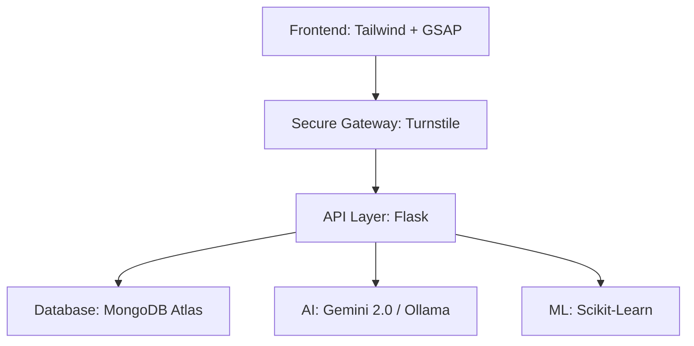

# Naya Judicial System
> **The Future of Justice, Powered by AI.**

**Naya Judicial System** is a next-generation judicial management platform designed to eliminate case pendency and modernize court proceedings. Built on a high-tier tech stack with **Google Gemini 2.0 Pro** and **Local LLMs**, NJS provides judges, clerks, and citizens with a seamless, secure, and intelligent legal ecosystem.

---

## 🏛️ Digital Courtroom Showcase

### 📊 Intelligence Dashboard
A premium Command Center featuring:
- **Dynamic Stats**: Real-time MongoDB-driven tracking of active cases and pending hearings.
- **Glassmorphic UI**: High-end visual design with frosted glass cards and smooth interactive transitions.
- **Personnel Tracking**: Live monitoring of active judicial officers and court loads.

### 🤖 AI-Powered Justice Suite
- **Duration Predictor**: Scikit-Learn based models forecasting hearing lengths.
- **Drafting Assist**: Generative AI workflows for legal orders and bail drafts.
- **Judicial Assistant**: Context-aware AI Chat (Gemini 2.0 / Ollama) with PII masking and local fallback.
- **Smart Evidence Vault**: AES-256 military-grade encryption for secure document storage.

### 👥 Public Citizen Portal
- **Transparent Search**: Deep search into real High Court metadata (2,000+ records).
- **Privacy First**: Automatic masking of sensitive petitioner and respondent identities.

---

## 🏗️ Architecture & Tech Stack



- **Backend**: Python 3.10+ (Flask)
- **Database**: MongoDB (Atlas/Local)
- **Frontend**: Vanilla JS, TailwindCSS, GSAP (Animations)
- **AI/ML**: Google GenAI, OpenAI, Ollama (Mistral/Llama), Scikit-Learn

---

## ⚙️ Installation & Rapid Setup

1.  **Clone & Enter**
    ```bash
    git clone https://github.com/ayaankhan434/Naya-Judicial-System.git
    cd Naya-Judicial-System
    ```

2.  **Infrastructure (env)**
    Create a `.env` file:
    ```env
    MONGO_URI=mongodb://localhost:27017/
    SECRET_KEY=your_secret_key
    AES_SECRET_KEY=your_32_byte_hex_key
    GOOGLE_API_KEY=your_gemini_api_key
    ```

3.  **Deploy Data & Run**
    ```bash
    pip install -r requirements.txt
    python scripts/import_real_data.py
    python run.py
    ```

---

## 🎥 Professional Demo
To verify the system's readiness at any time, run the integrated demo suite:
```bash
python scripts/demo.py
```
This script validates connectivity, AI readiness, and database integrity.

---
*Built with precision for the Government of India. Secure. Encrypted. Infinite.*
